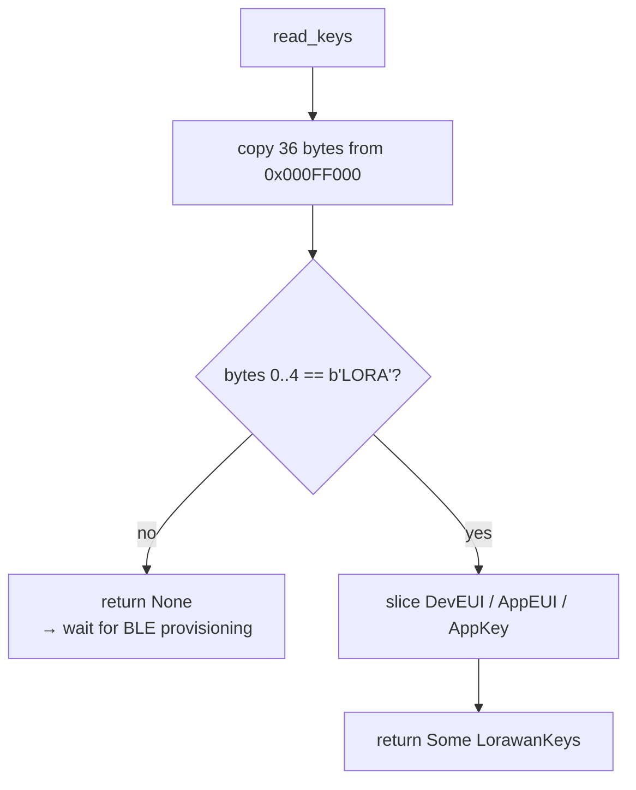
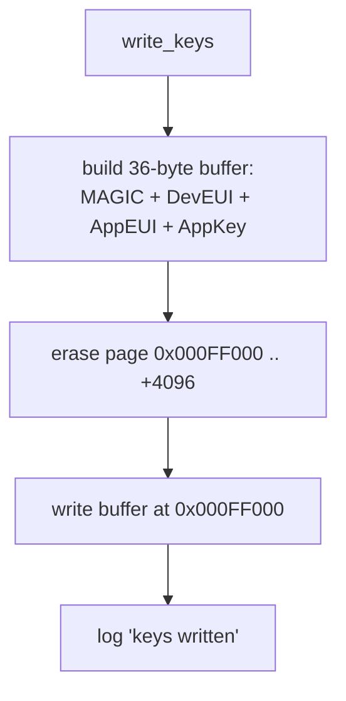

# Flash Storage

How the device persists LoRaWAN credentials so they survive reboots and
power loss. Implemented in [`src/flash.rs`](../firmware/src/flash.rs); the record type is
`LorawanKeys` in [`src/shared.rs`](../firmware/src/shared.rs).

## Where it lives

The nRF52840 has 1 MB of internal flash, memory-mapped and readable directly by
the CPU. We reserve the **last 4 KB page** for a single storage record.

| Property | Value |
| --- | --- |
| Storage address | `0x000F_F000` |
| Page size (erase granularity) | 4096 bytes (4 KB) |
| Record length used | 36 bytes |
| Records per page | 1 |

## Record layout

```
0x000F_F000
┌────────┬──────────┬──────────┬──────────────┐
│ MAGIC  │ DevEUI   │ AppEUI   │ AppKey       │
│ "LORA" │          │          │              │
│ 4 B    │ 8 B      │ 8 B      │ 16 B         │
└────────┴──────────┴──────────┴──────────────┘
   0..4     4..12     12..20      20..36
```

| Offset | Length | Field | Notes |
| --- | --- | --- | --- |
| 0 | 4 | Magic `b"LORA"` | Validity marker. Absence ⇒ "no record". |
| 4 | 8 | DevEUI | OTAA device identifier. |
| 12 | 8 | AppEUI | OTAA application identifier. |
| 20 | 16 | AppKey | OTAA root key. |
| — | — | **36 total** | Remainder of the 4 KB page is unused. |

## Reading

`read_keys()` does a raw memory-mapped read — flash is directly addressable, so
it `copy_nonoverlapping`s 36 bytes from `STORAGE_ADDR` into a stack buffer.



A `None` result is the signal used at boot to fall back to BLE provisioning —
it is not treated as an error.

## Writing

Flash can only be **erased a whole page at a time**, and bits can only go
1→0 on write, so any update is erase-then-write of the full page:



### Timing caveat

A page erase halts the CPU for tens of milliseconds. This is why the BLE handler
([provisioning.md](provisioning.md)) sends its GATT reply **before** calling
`write_keys`, and why the write is skipped entirely when the incoming keys match
what's already stored.

## Design notes / limitations

- **Single record, no wear leveling.** One fixed slot, rewritten in place. Fine
  for credentials that change rarely; not suitable for high-frequency writes.
- **No versioning yet.** The magic is a plain validity check, not a schema
  version. A future change that stores additional state (e.g. valve state) is
  planned to bump the magic to `b"FCV1"` and grow the record — old `b"LORA"`
  records would then read as "no record" and trigger re-provisioning. See
  [uplink-downlink.md](uplink-downlink.md) for the roadmap context.

## Related docs
- [provisioning.md](provisioning.md) — where writes originate.
- [startup.md](startup.md) — where the boot-time read happens.
