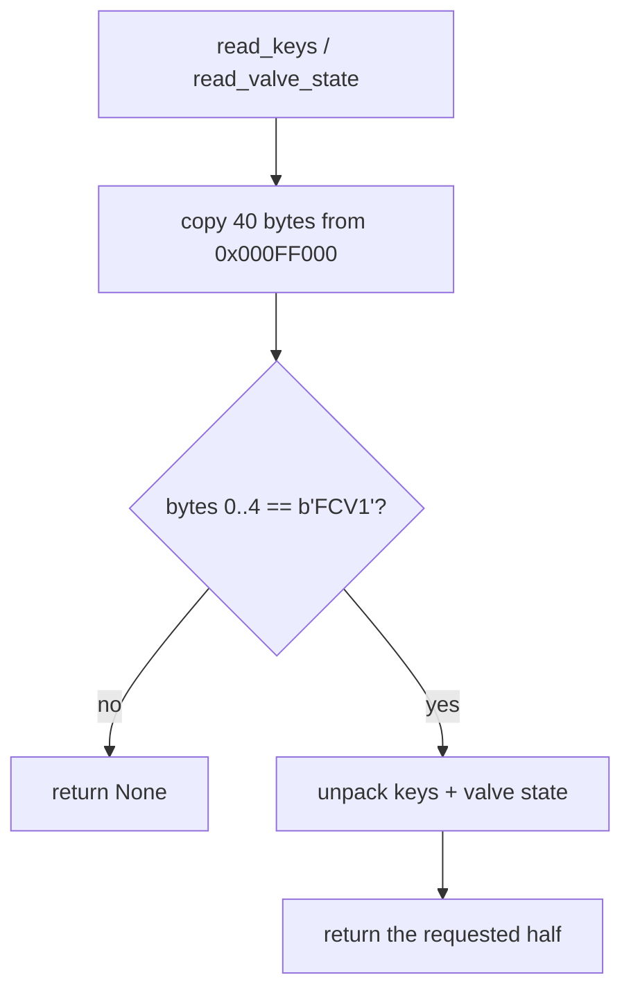
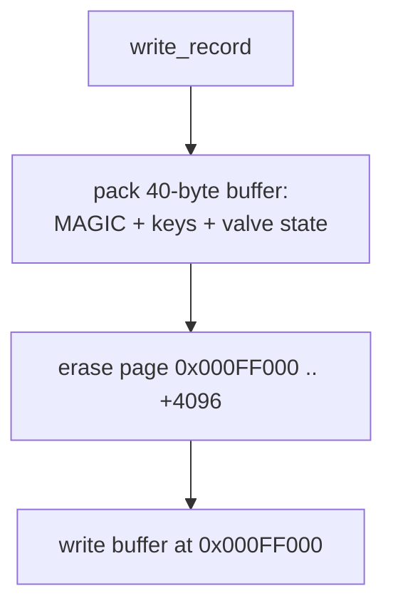

# Flash Storage

How the device persists LoRaWAN credentials **and** valve state so they survive
reboots and power loss. The record format (pack/unpack + validation) is portable
and lives in [`domain/src/record.rs`](../domain/src/record.rs); the firmware
wrapper (memory-mapped reads, `Nvmc` erase/write) is in
[`src/flash.rs`](../firmware/src/flash.rs). `LorawanKeys`/`ValveState` are
`domain` types.

## Where it lives

The nRF52840 has 1 MB of internal flash, memory-mapped and readable directly by
the CPU. We reserve the **last 4 KB page** for a single storage record.

| Property | Value |
| --- | --- |
| Storage address | `0x000F_F000` |
| Page size (erase granularity) | 4096 bytes (4 KB) |
| Record length used | 40 bytes |
| Records per page | 1 |

## Record layout

```
0x000F_F000
┌────────┬────────┬────────┬──────────┬───────┬──────────┐
│ MAGIC  │ DevEUI │ AppEUI │ AppKey   │ VALVE │ reserved │
│ "FCV1" │        │        │          │ STATE │          │
│ 4 B    │ 8 B    │ 8 B    │ 16 B     │ 1 B   │ 3 B      │
└────────┴────────┴────────┴──────────┴───────┴──────────┘
  0..4     4..12    12..20    20..36     36      37..40
```

| Offset | Length | Field | Notes |
| --- | --- | --- | --- |
| 0 | 4 | Magic `b"FCV1"` | Validity marker. Absence ⇒ "no record". |
| 4 | 8 | DevEUI | OTAA device identifier. |
| 12 | 8 | AppEUI | OTAA application identifier. |
| 20 | 16 | AppKey | OTAA root key. |
| 36 | 1 | ValveState | `1`=Open, `2`=Closed; `0` / erased `0xFF` ⇒ Unknown. |
| 37 | 3 | reserved | Zero-filled; room to grow the record. |
| — | — | **40 total** | Remainder of the 4 KB page is unused. |

`domain::record::{pack_record, unpack_record}` own this byte layout;
`firmware/src/flash.rs` calls them and adds the hardware I/O. The record
previously used a 36-byte `b"LORA"` (keys-only) format — the magic bump means any
old record reads as "no record" and triggers re-provisioning.

## Reading

Reads are raw memory-mapped `copy_nonoverlapping` of 40 bytes from `STORAGE_ADDR`,
then `unpack_record` validates the magic. Two accessors project out each half:

- `read_keys()` → `Option<LorawanKeys>`
- `read_valve_state()` → `Option<ValveState>`



A `None` from `read_keys()` at boot is the signal to fall back to BLE
provisioning — it is not treated as an error.

## Writing

Flash can only be **erased a whole page at a time**, and bits only go 1→0 on
write, so every update is an erase-then-write of the full 40-byte record:

- `write_keys(nvmc, keys)` — used by BLE provisioning. **Preserves** the
  currently-stored valve state (reads it first, defaults `Unknown`).
- `FlashStore::persist(keys, state)` — the `domain::Store` impl used by the
  LoRaWAN task to write valve state after an actuation (and at boot).



Both the BLE task (key writes) and the LoRaWAN task (valve-state writes) reach
the same `Nvmc` through an async `Mutex` (`shared::SharedNvmc`), so writes from
either side serialize.

### Timing caveat

A page erase halts the CPU for tens of milliseconds. This is why the BLE handler
([provisioning.md](provisioning.md)) sends its GATT reply **before** calling
`write_keys`, and why the write is skipped entirely when the incoming keys match
what's already stored.

## Design notes / limitations

- **Single record, no wear leveling.** One fixed slot, rewritten in place. Fine
  for state that changes rarely; not suitable for high-frequency writes.
- **Magic is a validity check, not a schema version.** A format change bumps the
  magic (as `LORA` → `FCV1` did) and lets old records fall back to "no record".

## Related docs
- [provisioning.md](provisioning.md) — where key writes originate.
- [startup.md](startup.md) — where the boot-time read happens.
- [valve-states.md](valve-states.md) — how valve state is decided and persisted.
