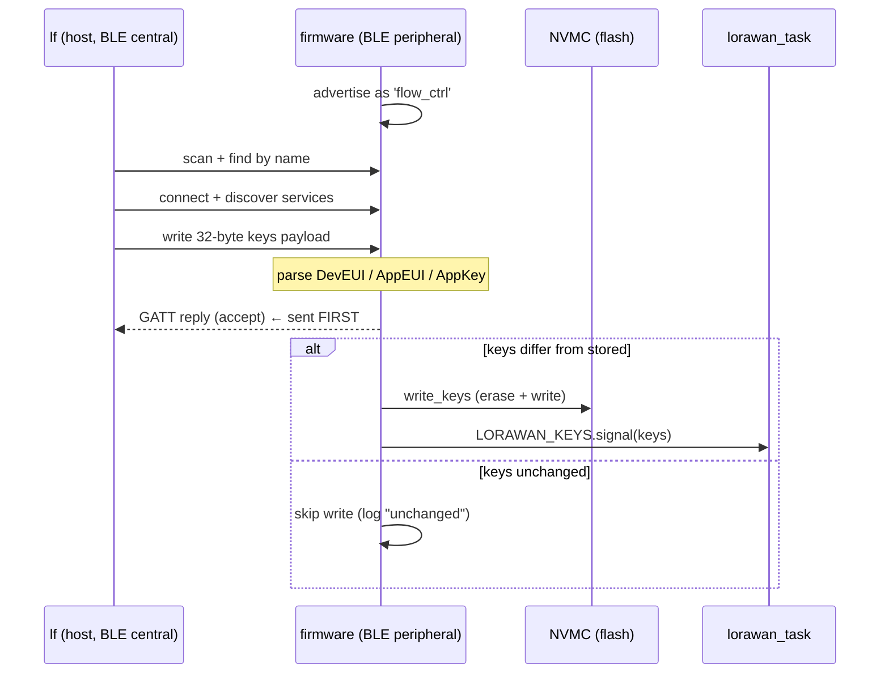

# Provisioning LoRaWAN Keys over BLE

How OTAA credentials (DevEUI, AppEUI, AppKey) get from a host machine onto the
device. The firmware is the **BLE peripheral**; the `lf` CLI
([`lorawan_flash`](../lorawan_flash/src/main.rs)) is the **BLE central**.
Firmware side lives in [`src/ble.rs`](../firmware/src/ble.rs).

## GATT contract

Both sides hardcode these identifiers — they must match exactly.

| Item | Value |
| --- | --- |
| Device name (advertised) | `flow_ctrl` |
| Service UUID | `12345678-1234-5678-1234-56789abcdef0` |
| Keys characteristic UUID | `12345678-1234-5678-1234-56789abcdef2` |
| Characteristic properties | read, write |
| Payload size | exactly **32 bytes** |

### Payload layout (32 bytes)

| Offset | Length | Field |
| --- | --- | --- |
| 0 | 8 | DevEUI |
| 8 | 8 | AppEUI |
| 16 | 16 | AppKey |

The CLI hex-decodes `DEVEUI` / `APPEUI` / `APPKEY` (from flags or env / `.env`),
validates the byte lengths, packs this buffer, and writes it with
`WriteType::WithResponse`.

## End-to-end flow

## Firmware handling, step by step

1. **Advertise** (`advertise` in `ble.rs`) — encodes an advertising packet with
   flags + the complete local name `flow_ctrl`, then waits for a central to
   connect and attaches the GATT attribute server.
2. **Handle GATT writes** (`gatt_events_task`) — loops on `conn.next()`. On a
   `GattEvent::Write` to the keys handle:
   - Rejects the payload with a warning if it isn't 32 bytes.
   - Otherwise slices out DevEUI `[0..8]`, AppEUI `[8..16]`, AppKey `[16..32]`
     into a `LorawanKeys`.
3. **Reply before flash** — the GATT reply is sent *before* any flash write.
   This is deliberate: a flash erase halts the CPU (~tens of ms), which would
   stall the BLE acknowledgement if done first.
4. **De-dupe** — compares the new keys against `flash::read_keys()`. If
   identical, it logs "keys unchanged" and does nothing. This avoids a needless
   flash erase/write cycle on repeat provisioning.
5. **Persist + signal** — on a real change, calls `flash::write_keys` and then
   `LORAWAN_KEYS.signal(keys)`.

## What the signal triggers

The `LORAWAN_KEYS` signal is the hand-off to the radio side. If the LoRaWAN task
is still waiting at boot, it wakes and joins. If it is already mid-loop with an
older set of keys, it breaks out and **re-joins** with the new credentials (see
the re-provisioning path in [uplink-downlink.md](uplink-downlink.md)).

## Reconnection / re-provisioning

`gatt_events_task` returns on disconnect, and `run_ble` loops back to advertise
again — so the device can be re-provisioned at any time without a reboot. New
keys simply overwrite flash and re-signal the LoRaWAN task.

## Host CLI reference

| Command | Purpose |
| --- | --- |
| `lf scan` / `mise run lf:scan` | List nearby BLE devices by name. |
| `lf provision` / `mise run lf:provision` | Connect by name, verify the service is present, write keys. Reads `DEVEUI`, `APPEUI`, `APPKEY`, `END_DEVICE` from env / `.env`. |

## Related docs
- [flash-storage.md](flash-storage.md) — how the written keys are laid out on flash.
- [startup.md](startup.md) — where `run_ble` sits in the boot sequence.
