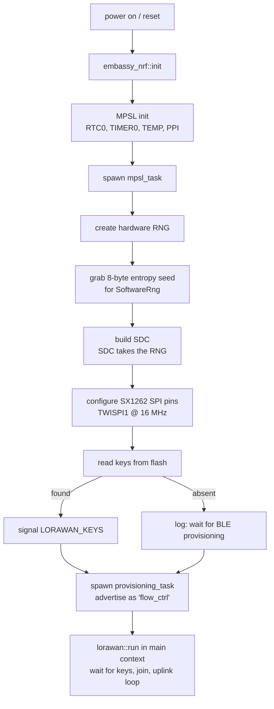
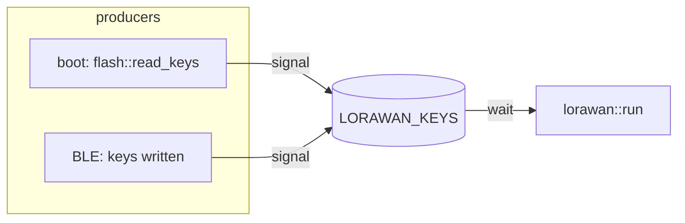

# Firmware Startup

What happens from power-on until the device is advertising over BLE and waiting
to join a LoRaWAN network. All of this lives in [`src/main.rs`](../firmware/src/main.rs).

## Why the order matters

The nRF52840 has **one** physical radio that BLE and LoRaWAN both use. Nordic's
Multiprotocol Service Layer (MPSL) time-slices it, and the SoftDevice Controller
(SDC) sits on top for the BLE link layer. Because of this, bring-up follows a
fixed order: clocks and MPSL first, then SDC, then the application radios and
tasks. SDC also takes ownership of the hardware RNG, so we must capture an
entropy seed for LoRaWAN *before* SDC is built.

## Boot sequence

## Init steps in detail

| Step | Code | Peripherals / resources | Notes |
| --- | --- | --- | --- |
| Peripheral access | `embassy_nrf::init` | all | Default config. |
| MPSL | `MultiprotocolServiceLayer::new` | `RTC0`, `TIMER0`, `TEMP`, `PPI_CH19/30/31` | Low-freq clock = internal RC oscillator (`MPSL_CLOCK_LF_SRC_RC`). Spawned as `mpsl_task`. |
| RNG seed | `rng.blocking_fill_bytes` | `RNG` | 8 bytes read into a `u64` **before** SDC claims the RNG. Seeds `SoftwareRng` for LoRaWAN. |
| SDC | `build_sdc` | `PPI_CH17..29`, `Mem<4720>` | BLE link-layer controller. Supports advertising + one peripheral connection. |
| SX1262 SPI | `spim::Spim::new` | `TWISPI1`, `P1_11/12/13` | 16 MHz. Control pins: NSS `P1_10`, reset `P1_06`, DIO1 `P1_15`, busy `P1_14`, RF switch RX `P1_05` / TX `P1_07`. |
| Flash load | `flash::read_keys` | `NVMC` | See [flash-storage.md](flash-storage.md). Signals keys immediately if present. |
| BLE provisioning | `spawner.spawn(ble::provisioning_task)` | SDC controller, `SharedNvmc` | Spawned as a background task; advertises + accepts key writes. See [provisioning.md](provisioning.md). |
| LoRaWAN loop | `lorawan::run(...).await` | SPI + control pins + `SoftwareRng`, `SharedNvmc` | The device's primary work; runs in the `main` context. See [uplink-downlink.md](uplink-downlink.md). |

## The two subsystems and how they meet

After startup there are effectively two concurrent flows:

- **BLE provisioning** (`ble::provisioning_task`, spawned) — advertises, accepts a connection, receives keys.
- **LoRaWAN** (`lorawan::run`, the main-context loop) — waits for keys, joins, uplinks on a timer.

They never call each other directly. They communicate through a single
`Signal<CriticalSectionRawMutex, LorawanKeys>` named `LORAWAN_KEYS`
(in [`src/shared.rs`](../firmware/src/shared.rs)):

At boot, if flash already holds keys, `LORAWAN_KEYS` is signalled right away and
the LoRaWAN task can join without any BLE interaction. Otherwise the task blocks
on `LORAWAN_KEYS.wait()` until provisioning happens.

## Related docs
- [provisioning.md](provisioning.md) — how keys get onto the device.
- [flash-storage.md](flash-storage.md) — what persists across reboots.
- [uplink-downlink.md](uplink-downlink.md) — the join + uplink/downlink loop.
