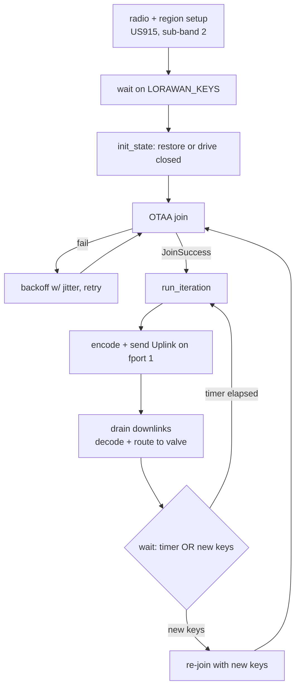
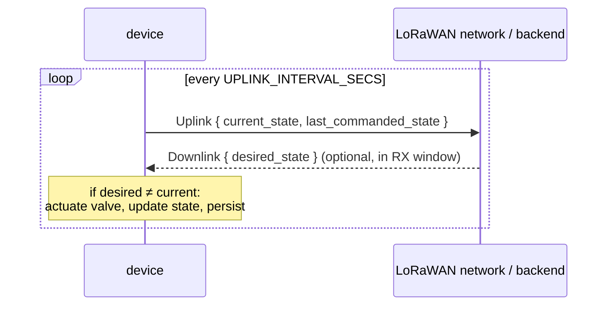

# Uplink / Downlink

The LoRaWAN Class-A messaging loop: join a network, send an `Uplink` on a timer,
and apply any `Downlink` that comes back in the RX window. The firmware side is
[`src/lorawan.rs`](../firmware/src/lorawan.rs); the portable loop body, codec, and
valve state machine live in the [`domain`](../domain) crate. The wire schema is
[`proto/flow_controller/v1/valve.proto`](../proto/flow_controller/v1/valve.proto).

> **Status.** Join, timer cadence, re-provisioning, serialized `Uplink`/`Downlink`,
> and routing commands into the valve state machine are implemented and
> host-tested (`cargo test -p domain`). The **actuator is a stub**
> ([`src/valve.rs`](../firmware/src/valve.rs) logs only, no GPIO). Uplink TX has
> run on hardware; **downlink RX has not been validated on hardware** yet.

## The loop

`lorawan::run` sets up the radio, waits for keys, joins, then drives
`domain::run_iteration` each interval. The firmware implements `domain`'s three
seams — `Network` (radio), `Valve` (actuator), `Store` (flash) — so the loop body
is hardware-agnostic and testable on the host.

## Radio & region configuration

| Setting | Value | Source |
| --- | --- | --- |
| Radio | Semtech SX1262 over SPI | `sx126x::Config` |
| Region | US915, join bias sub-band 2 | `US915::set_join_bias(Subband::_2)` |
| Max TX power | 14 dBm | `shared::MAX_TX_POWER` |
| RX window lead time | 100 | `set_rx_window_lead_time` |
| RX window buffer | 200 | `set_rx_window_buffer` |
| Uplink interval | 300 s (5 min) | `shared::UPLINK_INTERVAL_SECS` |
| Uplink fport | 1 | `domain::runtime::FPORT` |
| Confirmed? | no | unconfirmed uplinks |

## Join with backoff

OTAA join retries in a loop until it succeeds. The delay comes from
`generate_delay(rng, retries)`:

- Base grows linearly: `10 + 10 * retries` seconds, capped at 3600 s.
- Jitter of ±20% from the `SoftwareRng` so a fleet doesn't retry in lockstep.

## One cycle (`run_iteration`)

Per interval, `domain::run_iteration`:

1. **Encodes** an `Uplink { current_state, last_commanded_state }` (micropb) and
   sends it on fport 1, unconfirmed.
2. **Drains** every downlink the RX window delivered (`Network::next_downlink` →
   `device.take_downlink()`), logging each on receipt (fport + length + bytes).
3. Decodes each as a `Downlink { desired_state }` and runs it through the valve
   state machine (`on_downlink`): a state different from `current` actuates the
   valve (stub), updates state, and persists to flash; an idempotent,
   `UNSPECIFIED`, or undecodable command is a no-op.

The firmware then `select`s on **either** the interval timer **or** a new
`LORAWAN_KEYS` signal — a new signal breaks the loop and re-joins, supporting live
re-provisioning without a reboot (see [provisioning.md](provisioning.md)).

## Wire format

Generated Rust types (via `proto_gen` / micropb) live in
[`domain/src/proto/`](../domain/src/proto/); the codec is `domain::codec`.

### `ValveState` enum

| Value | Number | Meaning |
| --- | --- | --- |
| `VALVE_STATE_UNSPECIFIED` | 0 | Field unset / no known state. Ignored as a command. |
| `VALVE_STATE_OPEN` | 1 | Valve open (flowing). |
| `VALVE_STATE_CLOSED` | 2 | Valve closed. |

### Messages

| Message | Direction | Fields |
| --- | --- | --- |
| `Uplink` | device → backend | `current_state`, `last_commanded_state` |
| `Downlink` | backend → device | `desired_state` |

- **`Uplink.current_state`** — what the device believes the physical valve is
  doing now.
- **`Uplink.last_commanded_state`** — the most recent state the backend asked
  for. Diverges from `current_state` while a command is in flight or if actuation
  fails — carrying both is the point (see [valve-states.md](valve-states.md)).
- **`Downlink.desired_state`** — the state the backend wants; the device applies
  it and reports the result on the next uplink. Send `OPEN` or `CLOSED`; an unset
  (`UNSPECIFIED`) value is ignored.

### Class-A exchange

A downlink must be queued at the network server **before** the uplink's RX
window — Class A only listens right after a TX, so command latency is up to one
uplink interval.

## Related docs
- [startup.md](startup.md) — how the LoRaWAN loop is set up and fed keys.
- [provisioning.md](provisioning.md) — the `LORAWAN_KEYS` signal that gates and
  restarts this loop.
- [valve-states.md](valve-states.md) — the state machine that downlinks drive.
