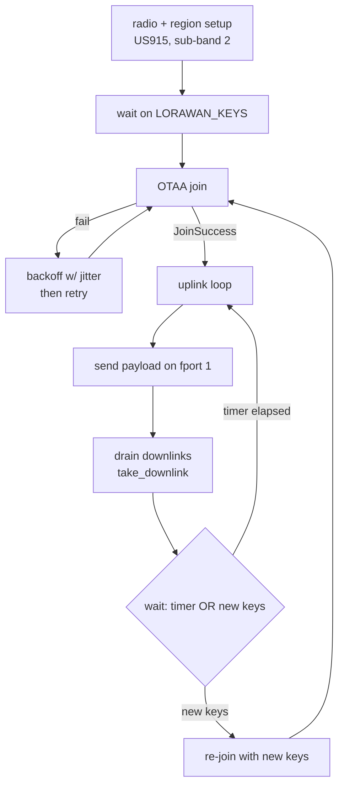
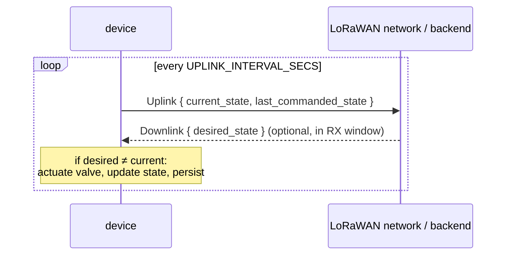

# Uplink / Downlink

The LoRaWAN Class-A messaging loop: join a network, send an uplink on a timer,
and process any downlink that comes back. Implemented in
[`src/lorawan.rs`](../firmware/src/lorawan.rs). The wire schema lives in
[`proto/flow_controller/v1/valve.proto`](../proto/flow_controller/v1/valve.proto).

> **Status.** The join loop, timer cadence, re-provisioning, and downlink
> draining are implemented. The **payload is currently a hardcoded
> `b"ponix"`** and downlinks are only logged. Wiring the protobuf `Uplink` /
> `Downlink` messages and a valve module is the in-progress phase — see
> [Planned wire format](#planned-wire-format) below.

## The task lifecycle

## Radio & region configuration

| Setting | Value | Source |
| --- | --- | --- |
| Radio | Semtech SX1262 over SPI | `sx126x::Config` |
| Region | US915, join bias sub-band 2 | `US915::set_join_bias(Subband::_2)` |
| Max TX power | 14 dBm | `shared::MAX_TX_POWER` |
| RX window lead time | 100 | `set_rx_window_lead_time` |
| RX window buffer | 200 | `set_rx_window_buffer` |
| Uplink interval | 5 s | `shared::UPLINK_INTERVAL_SECS` |
| Uplink fport | 1 | `device.send(msg, 1, false)` |
| Confirmed? | no (`false`) | unconfirmed uplinks |

## Join with backoff

OTAA join retries in a loop until it succeeds. The delay between attempts comes
from `generate_delay(rng, retries)`:

- Base grows linearly: `10 + 10 * retries` seconds, capped at 3600 s.
- Jitter of ±20% is added from the `SoftwareRng` so a fleet of devices doesn't
  retry in lockstep.

## Uplink loop & downlink handling

After a successful join the task loops:

1. Send the payload on fport 1 (unconfirmed).
2. On success, drain every queued downlink with `device.take_downlink()`.
   Today each is just logged (port + hex bytes).
3. Wait via `select` on **either** the interval timer **or** a new
   `LORAWAN_KEYS` signal.
   - Timer fires → send again.
   - New keys arrive → break the inner loop and re-join (supports live
     re-provisioning without a reboot).

## Planned wire format

The [`valve.proto`](../proto/flow_controller/v1/valve.proto) schema is
already defined and code-generated (via `proto_gen` / micropb) into
[`src/proto/`](../firmware/src/proto/), but not yet serialized on the wire.

### `ValveState` enum

| Value | Number | Meaning |
| --- | --- | --- |
| `VALVE_STATE_UNSPECIFIED` | 0 | Default / never sent as a command. |
| `VALVE_STATE_OPEN` | 1 | Valve open (flowing). |
| `VALVE_STATE_CLOSED` | 2 | Valve closed. |
| `VALVE_STATE_UNKNOWN` | 3 | State indeterminate. |

### Messages

| Message | Direction | Fields |
| --- | --- | --- |
| `Uplink` | device → backend | `current_state`, `last_commanded_state` |
| `Downlink` | backend → device | `desired_state` |

- **`Uplink.current_state`** — what the device believes the physical valve is
  doing right now.
- **`Uplink.last_commanded_state`** — the most recent state the backend asked
  for. It diverges from `current_state` while a command is in flight or if
  actuation failed — that gap is the whole point of carrying both.
- **`Downlink.desired_state`** — the state the backend wants; the device
  executes it and reports the result on the next uplink. The backend should not
  send `UNKNOWN`.

### Intended Class-A exchange

The planned work replaces `b"ponix"` with a serialized `Uplink`, decodes
`Downlink` from the drained downlink bytes, routes the command into a valve
module (initially a log-only stub — no GPIO), and persists valve state in flash
alongside the keys. That flash change is why [flash-storage.md](flash-storage.md)
notes a future magic bump to `b"FCV1"`.

## Related docs
- [startup.md](startup.md) — how the LoRaWAN task is spawned and fed keys.
- [provisioning.md](provisioning.md) — the `LORAWAN_KEYS` signal that gates and
  restarts this loop.
