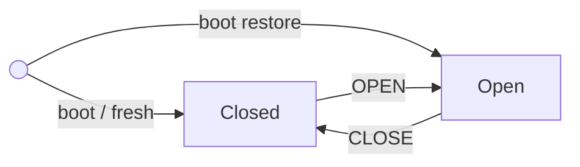

# Valve States

The valve controller tracks the valve's believed **physical state** and evolves
it in response to decoded downlinks. The pure logic lives in the `domain` crate:
the transition rules in [`domain/src/state.rs`](../domain/src/state.rs), the boot
policy (`init_state`) in [`domain/src/runtime.rs`](../domain/src/runtime.rs), and
the `ValveState` enum in [`domain/src/types.rs`](../domain/src/types.rs).

> **Status.** The state logic, boot policy, decoding, and flash persistence are
> implemented and host-tested (`cargo test -p domain`). Actuation is still a
> **stub** — [`firmware/src/valve.rs`](../firmware/src/valve.rs) `open`/`close`
> only log via defmt; no GPIO drives the solenoid until the Phase 4 STSPIN250
> driver. So the boot "drive closed" fires the state logic but moves no hardware
> yet.

## States

| State | Meaning |
| --- | --- |
| `Open` | Valve open (flowing). |
| `Closed` | Valve closed. |
| `Unknown` | "No known position" — a fresh device or erased record. Not a resting runtime state: on boot it is resolved to `Closed` (see below). Never a valid *command*. |

## Boot state

At startup, [`init_state`](../domain/src/runtime.rs) decides where `current`
begins:

- A persisted `Open` or `Closed` is **restored** as-is — the normal case, since
  state is written on every actuation.
- With **no known position** (no record, or `Unknown`), the valve is **driven
  closed** and `Closed` is persisted, so a fresh device establishes a
  guaranteed-closed state rather than an assumed one. Re-closing a latching valve
  is harmless, so this is safe even if it was already closed.

So `Unknown` never persists as a resting state — it is only the transient
"no data" input that boot resolves to `Closed`.

## State machine

At runtime `current` moves only between `Open` and `Closed`, and only when a
downlink commands the state it isn't already in. Edge labels are the commanded
state; the no-op cases (idempotent, ignored, undecodable) are omitted here — see
the outcome table below.

## How a downlink is applied

`on_downlink` decodes the payload and returns a `DownlinkOutcome`:

| Outcome | When | Effect on `current` |
| --- | --- | --- |
| `Transition(target)` | Decodable command ≠ `current` | Actuate → `on_actuated` sets `current` → persist to flash. |
| `Unchanged` | Command already equals `current` | None (idempotent). |
| `Ignored` | Command is `UNKNOWN` | None. |
| `Undecodable` | Payload isn't a valid `Downlink` | None. |

Because boot resolves `Unknown` to `Closed`, `current` is only ever `Open` or
`Closed` at runtime; an `UNKNOWN` command is still `Ignored` (the backend must
not send it).

## `last_commanded` — the second tracked value

Alongside `current`, `ClientState` tracks `last_commanded`: the most recent state
the backend asked for. It updates on **every** decodable command (even
idempotent ones), *before* actuation. It is not its own state machine — it is a
shadow of backend intent, reported next to `current` in each uplink so the two
can diverge once a real driver can fail an actuation. See
[uplink-downlink.md](uplink-downlink.md).

## Related docs
- [uplink-downlink.md](uplink-downlink.md) — how downlinks are received and the
  uplink that reports `current` + `last_commanded`.
- [flash-storage.md](flash-storage.md) — how valve state is persisted alongside
  the keys and hydrated on boot.
